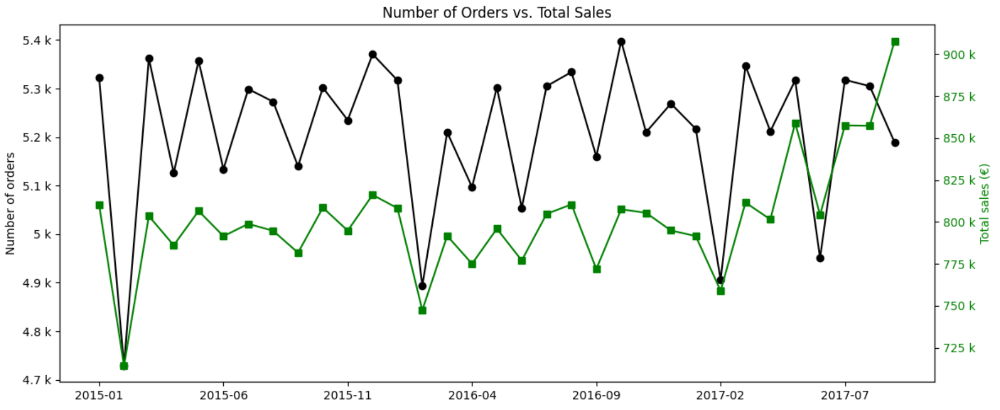
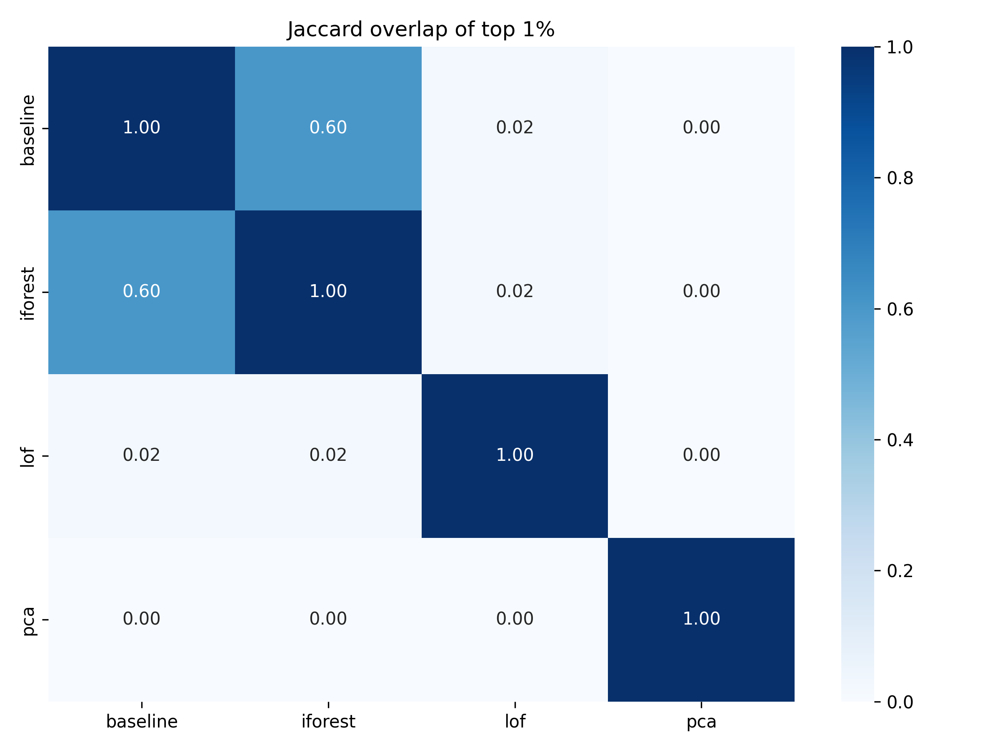
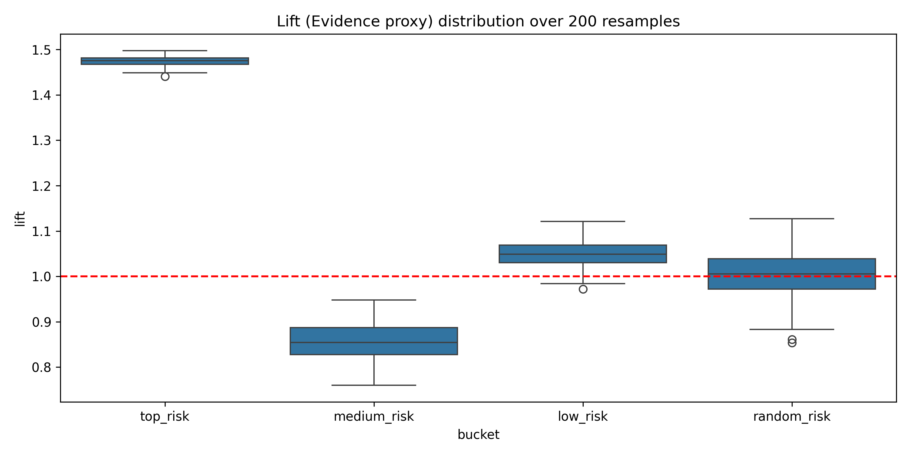

# 📦 Supply Anomaly Classification
> Order-level anomaly detection for the **DataCo supply chain dataset**  
> using **171 962 records (2015–2017)** and **4 sequential notebooks**

`data preprocessing + feature engineering + unsupervised anomaly detection + production scoring`

`pandas` `numpy` `scikit-learn` `joblib` `matplotlib` `seaborn`

---

## 🧭 Project story
This analysis treats **supply chain order data** as a structured operational process, not as a collection of isolated transactions.  
The goal is to build a compact anomaly detection workflow that captures unusual shipping and discount patterns.
1. clean and standardize the raw order table
2. engineer interpretable shipping and discount deviation features
3. compare unsupervised anomaly detection methods
4. package the best approach for production scoring of a new order

---

## 🎯 Research question
The analysis is built around four core questions:
- Which order attributes best capture anomalous supply chain behavior?
- Are shipping deviations or discount deviations more informative?
- Which unsupervised method produces the most stable and business-relevant anomaly ranking?
- Can the final pipeline classify a new order into a human-readable anomaly type?

---

## Results / Charts
The data show that **order-level anomalies can be detected reliably using only two domain signals**: shipping deviation and discount deviation.


<u>Chart description:</u>  
This chart displays monthly order counts and total sales revenue spanning January 2015 through September 2017, revealing stable operational patterns with 5,000–5,500 orders and €750k–€900k sales per month.

---


<u>Chart description:</u>  
Isolation Forest and baseline percentile ranking show the strongest agreement (0.60) on top 1% anomalies, while LOF and PCA diverge entirely (0.00–0.02). This makes **Isolation Forest the most production-ready choice**, combining stability with the operational context that simpler baselines capture.

---


<u>Chart description:</u>  
Top-risk flagged items are 1.48 times more likely to actually be anomalies. This number stays consistent across all 200 test runs.   
Medium-risk items are a crap-shoot (sometimes 0.77× useful, sometimes 0.95×).   
Low and random risk buckets are basically the same as picking randomly.

---

## Project structure

```text  
supply-anomaly-classification/  
├── config/  
│   └── settings.py  
├── data/  
│   ├── assets/
│   ├── processed/
│   └── raw/  
├── notebooks/  
│   ├── 01_data_preprocessing_and_eda.ipynb  
│   ├── 02_feature_engineering.ipynb  
│   ├── 03_unsupervised_anomaly_detection.ipynb  
│   └── 04_production_anomaly_scoring.ipynb  
├── results/  
│   ├── figures/  
│   └── tables/  
├── README.md  
└── requirements.txt
```
---

## Key Findings
- **Shipping delay** is the clearest operational anomaly signal 
- **Discount variance** adds useful complementary information
- **Isolation Forest** is the strongest production candidate because it is stable across seeds and captures business-relevant cases
- **LOF** is less reliable because its results vary strongly with neighborhood size
- **PCA reconstruction error** does not separate anomalies well in this setting
- The final pipeline can classify suspicious orders into **shipping**, **discount**, **mixed**, or **none**

| Method             | Stability | Business relevance | Production use       |
|:-------------------|:---------:|:------------------:|:---------------------|
| Percentile ranking |   High    |       Medium       | Baseline             |
| Isolation Forest   |   High    |        High        | Best candidate       |
| LOF                |    Low    |       Medium       | Secondary comparison |
| PCA                |   High    |        Low         | Not recommended      |

**Metrics**   
**Stability**: consistency across seeds / parameter settings   
**Domain lift**: enrichment of shipping or discount anomalies in top-ranked cases   

🏆 **Isolation Forest** is best overall choice for operational anomaly review

---

## Dataset
### DataCo supply chain orders
Period: January 01, 2015 – September 30, 2017   
Rows: 171,962   
Size: 1.8 MB

---

## How to reproduce
1. Clone the repository
2. Install the required Python dependencies   
   `pip install -r requirements.txt`
3. Run the pipeline (sequential notebooks)   
   `01_data_preprocessing_and_eda.ipynb`   
   `02_feature_engineering.ipynb`   
   `03_unsupervised_anomaly_detection.ipynb`   
   `04_production_anomaly_scoring.ipynb`

**Optional**   
Review the notebooks individually to understand the full logic   
`01_data_preprocessing_and_eda.ipynb` — data cleaning, type optimization, EDA   
`02_feature_engineering.ipynb` — shipping and discount feature construction   
`03_unsupervised_anomaly_detection.ipynb` — model comparison, ranking, stability   
`04_production_anomaly_scoring.ipynb` - inference, validation, explanation generation

---

## Links
- [01_data_preprocessing_and_eda.ipynb](notebooks/01_data_preprocessing_and_eda.ipynb)
- [02_feature_engineering.ipynb](notebooks/02_feature_engineering.ipynb)
- [03_unsupervised_anomaly_detection.ipynb](notebooks/03_unsupervised_anomaly_detection.ipynb)
- [04_production_anomaly_scoring.ipynb](notebooks/04_production_anomaly_scoring.ipynb)
